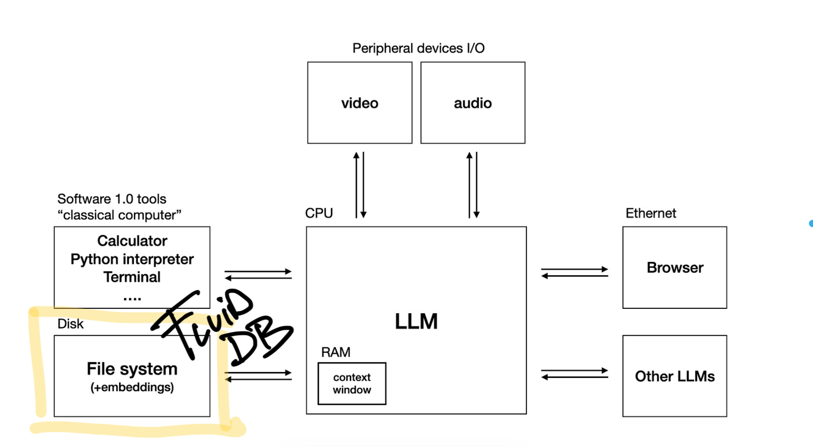

<h2 align="center">
  FluidDB
</h2>
<h3 align="center">
  Self-Organizing Databases
</h3>

---
Research repo for experimenting with the concept of a fluid database.



### What is Fluid Database?

Fluid database is a concept for databases that can update their schema based on the ingested data.

Key features:
- Adaptive Schema: Automatically adjusts its structure based on the data being ingested.
- Flexible Querying: Supports both traditional query languages and intuitive natural language queries.
- Versatile Data Input: Enables data entry in natural language, as well as in semi-structured formats.

### FluidDB MVP - TODO
- [ ] FluidDBAgent
- [ ] Inject Datbases Engine
- [ ] Eval Memory System
- [ ] CLI
- [ ] Router - Structured / Unstructured
- [ ] ColBERT


#### FluidDB Example

FluidDB saves unstructured data in a structured form.
```py
# Saving a simple natural language statement into FluidDB
fluiddb.save(uid, "hey adam here and i like thinking about the roman empire")
```
FluidDB automatically updates its schema to reflect this new data:
```json
{
    "name": "Adam",
    "interests": ["thinking about the Roman Empire"]
}
```

Further, FluidDB demonstrates its versatility with semi-structured data formats. For instance:

```py
# Storing structured data like an email
email = {
    "from": "david@themind.ai",
    "to": "adam@themind.ai",
    "subject": "Check this out",
    "content": "Hi Adam, Hope this email finds you well ..."
}
fluiddb.save(uid, email)
```
FluidDB then incorporates this new information into its schema:
```json
{
    "name": "Adam",
    "interests": ["thinking about the Roman Empire", "blue bottle"],
    "email": [{
        "from": "david@themind.ai",
        "to": "adam@themind.ai",
        "subject": "Check this out",
        "content": "Hi Adam, Hope this email finds you well ..."
    }]
}
```

### Getting Started

```bash
building...
```
